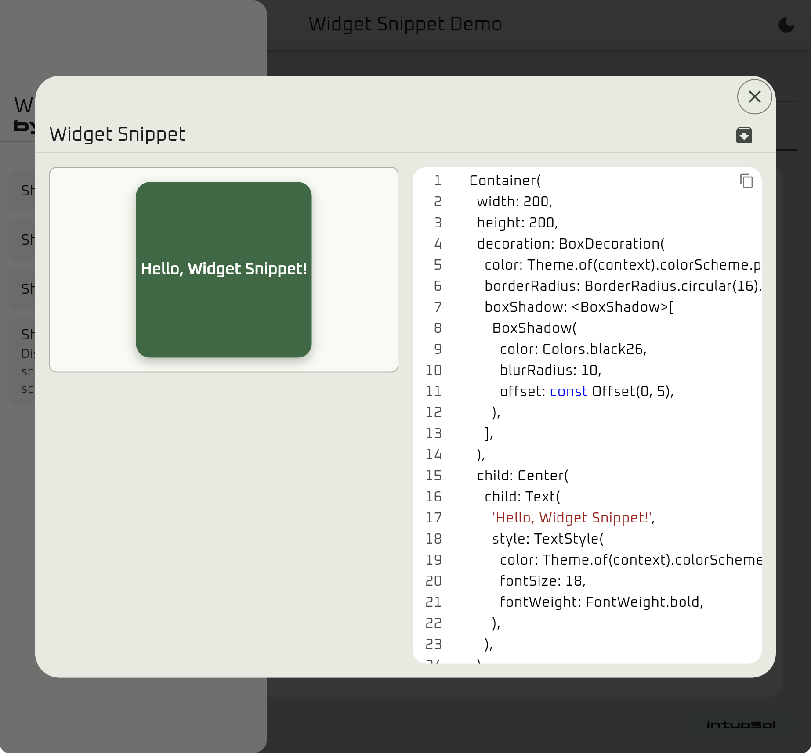

<?code-excerpt path-base="example/lib"?>

# Widget Snippet 

[](https://flutter.dev)
[](https://pub.dev/packages/widget_snippet)
[](https://pub.dev/packages/widget_snippet/score)
[](https://pub.dev/documentation/widget_snippet)
[](https://intuosol.github.io/widget_snippet/)
[](https://github.com/intuosol/widget_snippet/commits/main)
[](https://intuosol.com)

A Flutter package for showcasing widget code snippets. Display, copy, and download widget previews with their source code in various presentation formats.

Try it out in the [demo app](https://intuosol.github.io/widget_snippet/).

|  |  |  |
| :-------------------------------------------------: | :-------------------------------------------------------: | :-------------------------------------------------: |

## Features

- **Widget Preview + Source Code Viewer**: Show the widget alongside its source code
- **Multiple Display Options**: Present code snippets in various formats to suit different use cases (e.g., row, column, tabbed)
- **Terminal Style Code View**: Display code snippets in a terminal window
- **Easy Export**: Download widgets as images, copy code snippets, or export both as a zip file
- **Customizable Appearance**: Style the presentation based on your app's theme

## Usage

### Basic Example

<?code-excerpt "doc_examples/basic_example.dart"?>

```dart
import 'package:flutter/material.dart';
import 'package:widget_snippet/widget_snippet.dart';

class MyHomePage extends StatelessWidget {
  const MyHomePage({super.key});

  // Define your widget
  static final Widget myCustomWidget = Container(
    width: 200,
    height: 200,
    decoration: BoxDecoration(
      color: Colors.blue,
      borderRadius: BorderRadius.circular(16),
      boxShadow: [
        BoxShadow(
          color: Colors.black26,
          blurRadius: 10,
          offset: const Offset(0, 5),
        ),
      ],
    ),
    child: const Center(
      child: Text(
        'Hello, Widget Snippet!',
        style: TextStyle(
          color: Colors.white,
          fontSize: 18,
          fontWeight: FontWeight.bold,
        ),
      ),
    ),
  );

  // The source code for your widget
  static final String sourceCode = '''
Container(
  width: 200,
  height: 200,
  decoration: BoxDecoration(
    color: Colors.blue,
    borderRadius: BorderRadius.circular(16),
    boxShadow: [
      BoxShadow(
        color: Colors.black26,
        blurRadius: 10,
        offset: const Offset(0, 5),
      ),
    ],
  ),
  child: const Center(
    child: Text(
      'Hello, Widget Snippet!',
      style: TextStyle(
        color: Colors.white,
        fontSize: 18,
        fontWeight: FontWeight.bold,
      ),
    ),
  ),
);
''';

  @override
  Widget build(BuildContext context) {
   return Scaffold(
      appBar: AppBar(title: const Text('Widget Snippet Demo')),
      body: Center(
        child: Column(
          mainAxisAlignment: MainAxisAlignment.center,
          children: [
            // Display the widget inline
            SizedBox(
              height: 400,
              child: WidgetSnippet(
                widget: myCustomWidget,
                sourceCode: sourceCode,
              ),
            ),
            const SizedBox(height: 20),
            // Button to show the widget in a responsive modal
            ElevatedButton(
              onPressed: () {
                WidgetSnippet.showModal(
                  context: context,
                  widget: myCustomWidget,
                  sourceCode: sourceCode,
                );
              },
              child: const Text('Show in Responsive Modal'),
            ),
            const SizedBox(height: 8),
            // Button to show the widget in a bottom sheet
            ElevatedButton(
              onPressed: () {
                WidgetSnippet.showBottomSheet(
                  context: context,
                  widget: myCustomWidget,
                  sourceCode: sourceCode,
                );
              },
              child: const Text('Show in Bottom Sheet'),
            ),
            // Button to show the widget in a dialog
            ElevatedButton(
              onPressed: () {
                WidgetSnippet.showPopup(
                  context: context,
                  widget: myCustomWidget,
                  sourceCode: sourceCode,
                );
              },
              child: const Text('Show in Popup'),
            ),
            // Button to show the widget in full screen
            ElevatedButton(
              onPressed: () {
                WidgetSnippet.showFullScreen(
                  context: context,
                  widget: myCustomWidget,
                  sourceCode: sourceCode,
                );
              },
              child: const Text('Show in Full Screen'),
            ),
          ],
        ),
      ),
    );
  }
}
```

## Display Methods

Widget Snippet provides multiple ways to display your widgets:

- `WidgetSnippet()`: Renders the widget and its code inline

- `WidgetSnippet.showModal()`: Calls `showPopup()` if the screen width is greater than 600px, otherwise `showBottomSheet()`

- `WidgetSnippet.showBottomSheet()`: Shows a bottom sheet containing the widget preview, code snippet, and download zip button.

  - `DisplayMode` defaults to `DisplayMode.column`.

- `WidgetSnippet.showPopup()`: Shows a centered dialog containing the widget preview, code snippet, and download zip button.

  - `DisplayMode` defaults to `DisplayMode.row` if the screen width is greater than 800px, otherwise `DisplayMode.tabbed`.

- `WidgetSnippet.showFullScreen()`: Navigates to a full-screen page displaying the widget and its code

  - `DisplayMode` defaults to `DisplayMode.tabbed` if a widget is provided, otherwise `DisplayMode.column`.

**The default display mode can be overridden by setting the `displayMode` property in the `WidgetSnippetConfig`.**

## Customization

You can customize the appearance and behavior of your widget snippets using the `WidgetSnippetConfig` class:

<?code-excerpt "doc_examples/customization_example.dart (build)"?>

```dart
WidgetSnippet(
  widget: myCustomWidget,
  sourceCode: sourceCode,
  config: WidgetSnippetConfig(
    // The title to display for the widget preview and file name
    title: 'Customization Example',

    // How to display the widget and code
    displayMode: DisplayMode.tabbed,

    // Spacing between widget and code
    spacing: 16,

    // The maximum number of lines to show in the code view
    maxLines: 20,

    // Terminal style (for terminal display mode)
    terminalStyle: const TerminalStyle(
      title: 'Code Snippet',
      brightness: Brightness.dark,
    ),
  ),
)
```

### Display Modes

- `DisplayMode.row`: Widget and code side by side (horizontal layout)
- `DisplayMode.column`: Widget above the code (vertical layout)
- `DisplayMode.tabbed`: Switch between widget and code with tabs (useful for small screens)

### Terminal Style

You can create terminal-style code viewers with customizable appearance:

<?code-excerpt "doc_examples/terminal_example.dart (build)"?>

```dart
WidgetSnippet(
  widget: myCustomWidget,
  sourceCode: sourceCode,
  config: WidgetSnippetConfig(
    terminalStyle: const TerminalStyle(
      title: 'Flutter Terminal',
      brightness: Brightness.dark,
    ),
  ),
)
```
